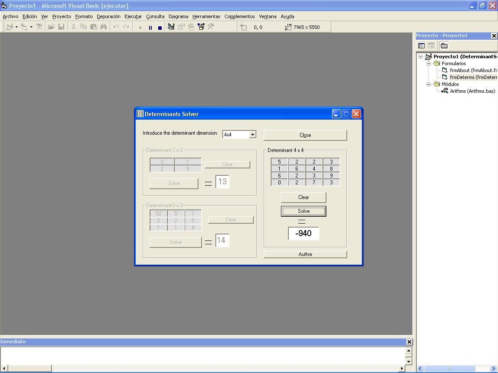



## Determinant Solver

### Description

I want to help the math or batx students with this program that this can solve determinants 2x2, 3x3, 4x4. No more. I believe that this can help you ;) Vote please, I 'll very happy jeje.
 
### More Info
 

             |
---                |---
**Submitted On**   |2002-10-21 10:44:04
**By**             |[Pau](https://github.com/Planet-Source-Code/PSCIndex/blob/master/ByAuthor/pau.md)
**Level**          |Beginner
**User Rating**    |4.0 (8 globes from 2 users)
**Compatibility**  |VB 6\.0
**Category**       |[Math/ Dates](https://github.com/Planet-Source-Code/PSCIndex/blob/master/ByCategory/math-dates__1-37.md)
**World**          |[Visual Basic](https://github.com/Planet-Source-Code/PSCIndex/blob/master/ByWorld/visual-basic.md)
**Archive File**   |[Determinan14848010212002\.zip](https://github.com/Planet-Source-Code/pau-determinant-solver__1-40022/archive/master.zip)

